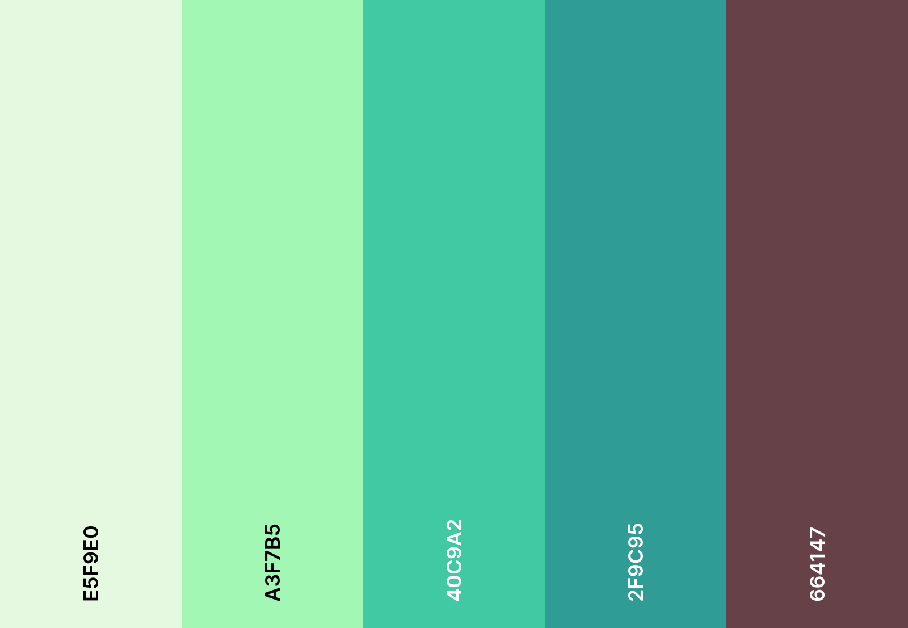

# Formative Activity - PW III

As said in the repository description this is the formative activity referent to the PW III Subject of my Software Development Course

This readme will be updated as the project evolves and the demand increases.

## Table of Contents
- [✨ Running the Project](#running-the-project)
- [🎨 Choosen Design](#choosen-design)
- [🏗️ Developing the Project](#developing-the-project)
- [📄 License](#license)

## Running the Project

Just clone the repository, run npm install and npm run dev at last... For now...

## Developoing the Project

Don't know how the development will be made yet...

## Choosen Design

This part is still being designed but the initial pallete is the following:

## License

This project is licensed under the Apache 2.0 License. See the [LICENSE](LICENSE) file for details.